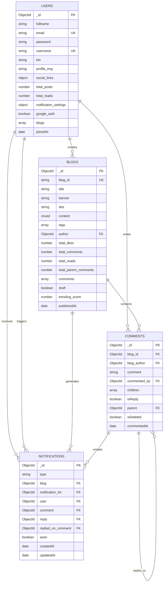

# Database Structure - MERN Blogging Website

## Entity Relationship Diagram



## Collections Overview

### 1. Users Collection
**Collection name:** `users`

| Field | Type | Description | Constraints |
|-------|------|-------------|-------------|
| _id | ObjectId | Primary Key | Auto-generated |
| personal_info.fullname | String | Full name | Required, Min 3 chars |
| personal_info.email | String | Email address | Required, Unique, Lowercase |
| personal_info.password | String | Hashed password | BCrypt hash |
| personal_info.username | String | Username | Unique, Min 3 chars |
| personal_info.bio | String | User biography | Max 200 chars |
| personal_info.profile_img | String | Profile image URL | Auto-generated (dicebear) |
| social_links | Object | Social media links | youtube, instagram, facebook, twitter, github, website |
| account_info.total_posts | Number | Total blog posts | Default: 0 |
| account_info.total_reads | Number | Total reads across all blogs | Default: 0 |
| notification_settings | Object | Notification preferences | all, comments, likes, replies |
| google_auth | Boolean | Google OAuth enabled | Default: false |
| blogs | Array[ObjectId] | Reference to blogs | Ref: 'blogs' |
| joinedAt | Date | Account creation date | Auto-generated |

### 2. Blogs Collection
**Collection name:** `blogs`

| Field | Type | Description | Constraints |
|-------|------|-------------|-------------|
| _id | ObjectId | Primary Key | Auto-generated |
| blog_id | String | URL-friendly ID | Required, Unique (nanoid) |
| title | String | Blog title | Required |
| banner | String | Banner image URL | Optional |
| des | String | Description | Max 200 chars |
| content | Mixed | Blog content | Editor.js format |
| tags | Array[String] | Blog tags | Optional |
| author | ObjectId | Blog author | Required, Ref: 'users' |
| activity.total_likes | Number | Total likes | Default: 0 |
| activity.total_comments | Number | Total comments (including replies) | Default: 0 |
| activity.total_reads | Number | Total views | Default: 0 |
| activity.total_parent_comments | Number | Parent comments only | Default: 0 |
| comments | Array[ObjectId] | Comment references | Ref: 'comments' |
| draft | Boolean | Draft status | Default: false |
| trending_score | Number | Calculated trending score | Default: 0 |
| publishedAt | Date | Publication date | Auto-generated |

**Trending Score Formula:**
```
score = (likes × 1 + comments × 3 + reads × 0.05) / (age_in_hours + 2)^1.8
```

### 3. Comments Collection
**Collection name:** `comments`

| Field | Type | Description | Constraints |
|-------|------|-------------|-------------|
| _id | ObjectId | Primary Key | Auto-generated |
| blog_id | ObjectId | Parent blog | Required, Ref: 'blogs' |
| blog_author | ObjectId | Blog author | Required, Ref: 'users' |
| comment | String | Comment text | Required |
| commented_by | ObjectId | Comment author | Required, Ref: 'users' |
| children | Array[ObjectId] | Child comments (replies) | Ref: 'comments' |
| isReply | Boolean | Is this a reply? | Optional |
| parent | ObjectId | Parent comment | Optional, Ref: 'comments' |
| isDeleted | Boolean | Soft delete flag | Default: false |
| commentedAt | Date | Comment creation date | Auto-generated |

**Tree Structure:**
```
Comment (parent)
├── Reply 1 (child, isReply: true, parent: Comment._id)
│   ├── Reply 1.1 (child of Reply 1)
│   └── Reply 1.2
└── Reply 2 (child, isReply: true, parent: Comment._id)
```

### 4. Notifications Collection
**Collection name:** `notifications`

| Field | Type | Description | Constraints |
|-------|------|-------------|-------------|
| _id | ObjectId | Primary Key | Auto-generated |
| type | String | Notification type | Enum: ["like", "comment", "reply"] |
| blog | ObjectId | Related blog | Required, Ref: 'blogs' |
| notification_for | ObjectId | Recipient user | Required, Ref: 'users' |
| user | ObjectId | Triggering user | Required, Ref: 'users' |
| comment | ObjectId | Related comment | Optional, Ref: 'comments' |
| reply | ObjectId | Reply comment | Optional, Ref: 'comments' |
| replied_on_comment | ObjectId | Original comment being replied to | Optional, Ref: 'comments' |
| seen | Boolean | Read status | Default: false |
| createdAt | Date | Creation timestamp | Auto-generated |
| updatedAt | Date | Last update timestamp | Auto-generated |

## Features Summary

✅ User authentication (JWT + Google OAuth)
✅ Blog CRUD operations
✅ Nested comment system (unlimited depth)
✅ Soft delete for comments
✅ Real-time notifications with badge count
✅ Smart trending algorithm with time decay
✅ Image upload (profile, banner, blog images)
✅ Social links integration
✅ Search functionality (title/tags/author)
✅ Notification preferences
✅ Draft system
